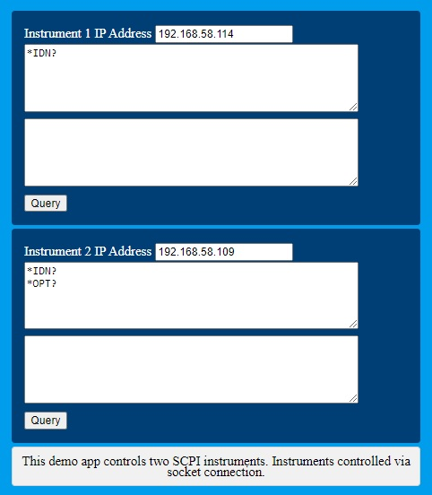

# Readme

## What is this repository for?
- Control test instruments from a web page!
- Simple Flask app to control test equipment

## Details
- GUI logic is in index.html
- app.py contains all working logic
- data dictionary passes data between two.

## Who do I talk to?
owner: Martin C Lim
